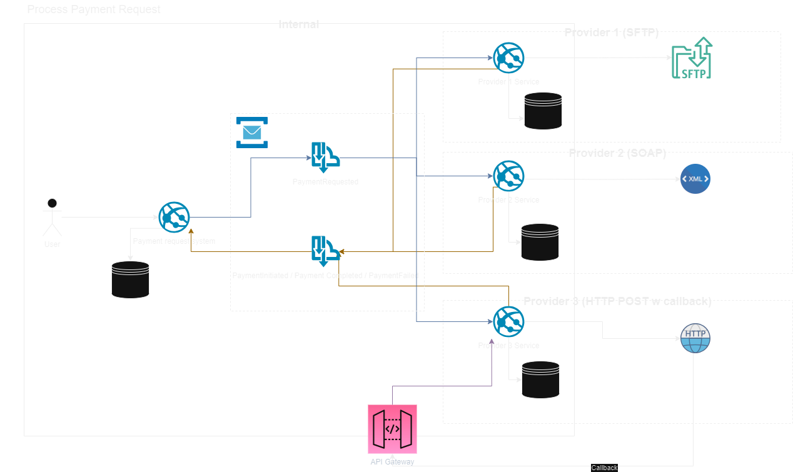

# Brief

Our system processes payments to recipients in different countries. To do that we need to integrate our system into multiple different banking systems. A manual version of this process would be as follows...

A user in our system exports a batch of payment requests (a payment is simply "please pay $120 to Fred Bloggs, account number X, ABA code Y").

This batch of payments is all for a single bank. The user logs into that banks system, issues a money transfer for each payment in the batch and then marks that payment as complete in our system.

Some banks may have an API we could call - these might be "send a file over SFTP and check back later", "Call a SOAP method" or "send an HTTP POST request and we'll POST a callback".

# Exercise

Assuming that we would like to replace the manual upload and reconciliation, how would you design a mechanism to automate this process?

# System Design Overview



## Architecture

- Event driven
- Each service is decoupled with its own data store and limited knowledge of other services

## Security

- All services, except the API Gateway, live on various interconnected private networks and are not exposed to the public internet
- The API Gateway is exposed publicly so that the HTTP callback from Provider 3 can be received
  - We could use something like an IP safe list to restrict access to Provider 3 via the API Gateway

### Considerations

- Would need to think about how we can achieve Exactly Once processing

### Events

- Reference data is used so that PII data is not transferred in messages. This could be sent encrypted if preferred
- Bank integration services would use the `bankId` property to decide if the message is relevant to them. If using Azure Service Bus, this could be added as a SQL Filter and parsed from headers to be more cost efficient

#### BatchPaymentRequested

```JSON
{
  "bankId": "6e8d22e9-ce18-4b72-8212-127396175c82",
  "batchId": "49a06117-9040-432b-81aa-cab724820175"
}
```

The `batchId` would be used to `GET` the payment data for the batch from the payment request system. This would then be used by the bank integration service to send the batch request to the bank.

#### BatchPaymentInitiated

```JSON
{
  "bankId": "6e8d22e9-ce18-4b72-8212-127396175c82",
  "batchId": "49a06117-9040-432b-81aa-cab724820175",
  "initiatedAt": "2023-07-23T18:47:31.4542670Z"
}
```

#### BatchPaymentCompleted

```JSON
{
  "bankId": "6e8d22e9-ce18-4b72-8212-127396175c82",
  "batchId": "49a06117-9040-432b-81aa-cab724820175",
  "completedAt": "2023-07-23T18:47:31.4542670Z"
}
```

#### BatchPaymentFailed

```JSON
{
  "bankId": "6e8d22e9-ce18-4b72-8212-127396175c82",
  "batchId": "49a06117-9040-432b-81aa-cab724820175",
  "failedAt": "2023-07-23T18:47:31.4542670Z",
  "error": {
    "correlationId": "42434234",
    "message": "Service was unreachable. Failed after three retries"
  }
}
```
